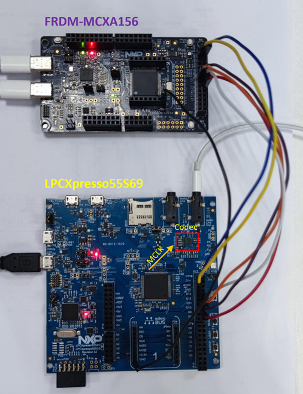

# NXP Application Code Hub

## AN14527 emulating i2s bus with flexio on mcxa156

This application note describes how to emulate I2S interface with FlexIO on MCXA156 and implement a USB speaker device on MCXA156. The audio function is tested using the codec on LPCXpress55s69 board.

In this application note, the I2S interface simulated by FlexIO is used as an I2S slave because MCXA156 does not have a PLL, and there is no external audio crystal oscillator on the FRDM-MCXA156 board. The audio format used in this application note is as follows:
- Transmit mode: Classic I2S mode
- Frame word count: 2
- Wordlength: 16
- BCLK frequency: 1.536MHz
- FSYNC frequency: 48KHz 
- MCLK frequency: 24.576MHz (provided by LPC55S69)

#### Boards: FRDM-MCXA156, LPCXpresso55S69
#### Categories: Audio
#### Peripherals: DMA, FlexIO, I2C, USB, I2S
#### Toolchains: MCUXpresso IDE

## Table of Contents
1. [Software](#step1)
2. [Hardware](#step2)
3. [Setup](#step3)
4. [Results](#step4)
5. [FAQs](#step5) 
6. [Support](#step6)
7. [Release Notes](#step7)

## 1. Software
- [MCUXpresso IDE V11.9.1 [build 2170] or later](https://www.nxp.com/design/software/development-software/mcuxpresso-software-and-tools-/mcuxpresso-integrated-development-environment-ide:MCUXpresso-IDE)
- [SDK_2.16.0_FRDM-MCXA156](https://mcuxpresso.nxp.com/en/welcome)
- MCUXpresso for Visual Studio Code: This example supports MCUXpresso for Visual Studio Code, for more information about how to use Visual Studio Code please refer [here](https://www.nxp.com/design/training/getting-started-with-mcuxpresso-for-visual-studio-code:TIP-GETTING-STARTED-WITH-MCUXPRESSO-FOR-VS-CODE).

## 2. Hardware
- FRDM-MCXA156 Rev A3 board:

- LPCXpresso55S69 Rev A2 board:

- Two Type-C USB cable.
- One micro USB cable
- 3.5mm Headphone (OMTP standard)
- 7 DuPont wires

## 3. Setup

### 3.1 Hardware connection

Please refer to the below table to connect FRDM-MCXA156 and LPCXpresso55S69 boards.

  |I2S signals|FRDM-MCXA156|LPCXpresso55S69|
  |--|--|--|
  |BCLK|P0_16/J8_13|P17_14|
  |FSYNC|P0_17/J8_14|P17_12|
  |TX_DATA|P0_18/J8_15|P17_10|
  |I2C_SCL|P1_8/J8_4|P17_3|
  |I2C_SDA|P1_9/J8_3|P17_1|
  |GPIO|P0_20/J8_17|P17_18/P1_28|
  |GND|J6_8|P23_8|

### 3.2 Download LPC55S69 firmware
Use blhost commands to download lpc55s69_i2s_mclk.bin firmware to LPCXpresso55S69 board. You can find lpc55s69_i2s_mclk.bin firmware in lpc55s69_firmware folder.

1. Press the ISP button S1 on LPCXpresso55S69 board and then connect P6 to PC using a micro USB cable to power on LPC55S69 and make it into ISP mode. Open the CMD window on PC and change the path to the lpc55s69_firmware folder, enter the below ISP command to download the firmware to LPC55S69:
- blhost.exe –p COM25 flash-erase-all 
- blhost.exe –p COM25 write-memory 0x00 lpc55s69_i2s_mclk.bin

  **Note that the serial port number (COMxx) here is the LPC-Link2 serial port number recognized by the PC, it may be different on different PC and you need to download blhost.exe from NXP website first.**

### 3.3 Download MCXA156 firmware

1. Use Type-C USB cable to connect the on-board MCU-Link connector J21 to PC USB port. 
2. Open MCUXpresso IDE 11.9.0, in the Quick Start Panel, choose **Import from Application Code Hub**

3. Enter the **demo name** in the search bar.

4. Click **Copy GitHub link**, MCUXpresso IDE will automatically retrieve project attributes, then click **Next>**.

5. Select **main** branch and then click **Next>**, select the MCUXpresso project, click **Finish** button to complete import.

> You need to install the [SDK_2.16.0_FRDM-MCXA156](https://mcuxpresso.nxp.com/en/welcome) on your MCUXpresso IDE.

6. Click **Build** to compile this project and then click **Debug** to download the program into FRDM-MCXA156 board.

### 3.4 Test audio function

1. Press the Reset button S4 on LPCXpresso55S69 board to run the LPC55S69 firmware first.
2. Press the Reset button SW1 on FRDM-MCXA156 to run this usb audio example.
3. Use another Type-C USB cable to connect the MCXA156 USB port J23 to the PC USB port, PC will  enumerate the MCXA156 as a USB audio device.

4. Play any audio file on PC, connect a 3.5mm headphone to **Audio Line output jack J2** on LPCXpresso55S69 board, then you can hear the audio from the PC.

## 4. Results

In this application note, PC will transmit the audio file to MCXA156 through the USB speaker interface. The I2S interface emulated by FlexIO acts as an I2S slave and forwards the audio data to the audio codec on the LPCXpresso55S69 board. If you can hear the audio from the PC through the headphone, this example has run successfully.

## 5. FAQs
*Include FAQs here if appropriate. If there are none, then remove this section.*

## 6. Support
*Provide URLs for help here.*

#### Project Metadata

<!----- Boards ----->

<!----- Categories ----->

<!----- Peripherals ----->

<!----- Toolchains ----->

Questions regarding the content/correctness of this example can be entered as Issues within this GitHub repository.

>**Warning**: For more general technical questions regarding NXP Microcontrollers and the difference in expected functionality, enter your questions on the [NXP Community Forum](https://community.nxp.com/)

## 7. Release Notes
| Version | Description / Update                           | Date                        |
|:-------:|------------------------------------------------|----------------------------:|
| 1.0     | Initial release on Application Code Hub        | November 14th 2024 |

<small> <b>Trademarks and Service Marks</b>: There are a number of proprietary logos, service marks, trademarks, slogans and product designations ("Marks") found on this Site. By making the Marks available on this Site, NXP is not granting you a license to use them in any fashion. Access to this Site does not confer upon you any license to the Marks under any of NXP or any third party's intellectual property rights. While NXP encourages others to link to our URL, no NXP trademark or service mark may be used as a hyperlink without NXP’s prior written permission. The following Marks are the property of NXP. This list is not comprehensive; the absence of a Mark from the list does not constitute a waiver of intellectual property rights established by NXP in a Mark. </small>   <small> NXP, the NXP logo, NXP SECURE CONNECTIONS FOR A SMARTER WORLD, Airfast, Altivec, ByLink, CodeWarrior, ColdFire, ColdFire+, CoolFlux, CoolFlux DSP, DESFire, EdgeLock, EdgeScale, EdgeVerse, elQ, Embrace, Freescale, GreenChip, HITAG, ICODE and I-CODE, Immersiv3D, I2C-bus logo , JCOP, Kinetis, Layerscape, MagniV, Mantis, MCCI, MIFARE, MIFARE Classic, MIFARE FleX, MIFARE4Mobile, MIFARE Plus, MIFARE Ultralight, MiGLO, MOBILEGT, NTAG, PEG, Plus X, POR, PowerQUICC, Processor Expert, QorIQ, QorIQ Qonverge, RoadLink wordmark and logo, SafeAssure, SafeAssure logo , SmartLX, SmartMX, StarCore, Symphony, Tower, TriMedia, Trimension, UCODE, VortiQa, Vybrid are trademarks of NXP B.V. All other product or service names are the property of their respective owners. © 2021 NXP B.V. </small>

